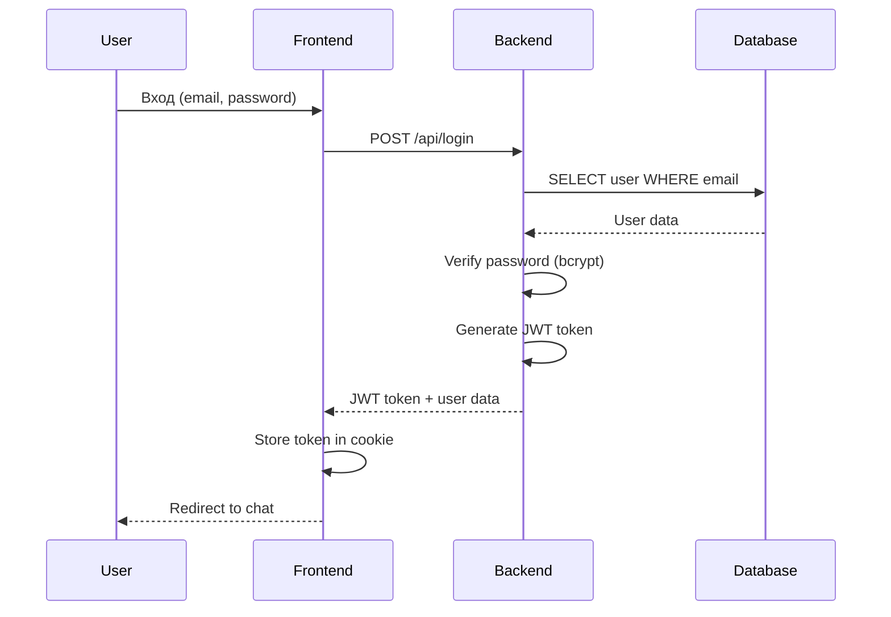
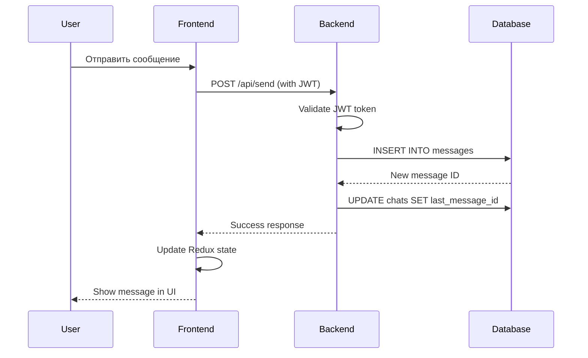
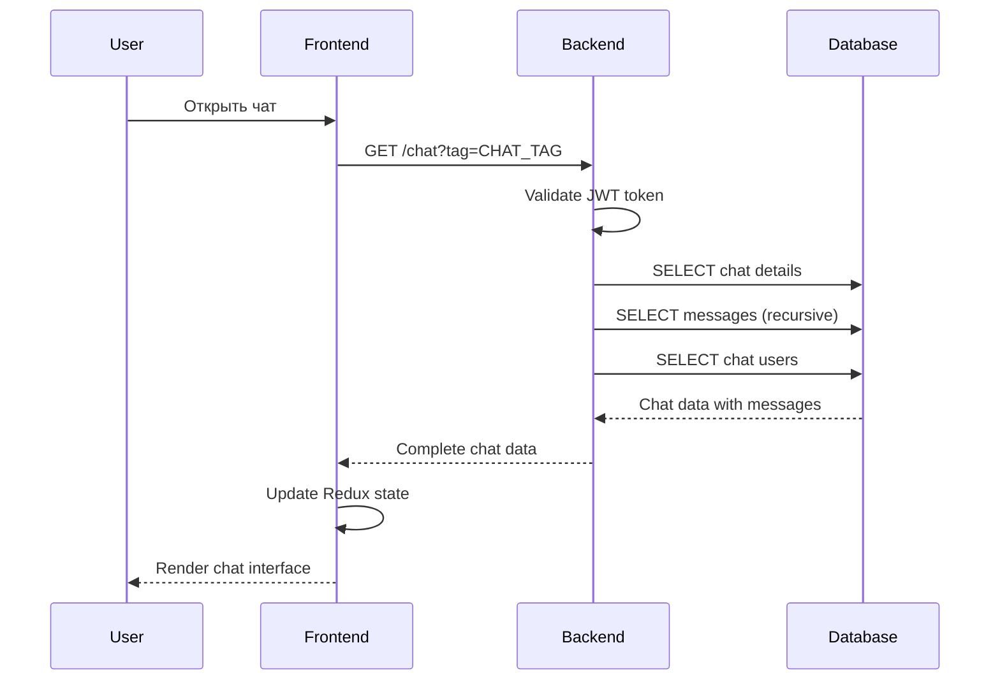

# 🏗️ Архитектура проекта Zcord

Подробное описание архитектуры мессенджера Zcord, включая компоненты системы, их взаимодействие и принципы проектирования.

## 📋 Содержание

- [Общий обзор](#общий-обзор)
- [Архитектурные принципы](#архитектурные-принципы)
- [Компоненты системы](#компоненты-системы)
- [Схема взаимодействия](#схема-взаимодействия)
- [Модель данных](#модель-данных)
- [API архитектура](#api-архитектура)
- [Безопасность](#безопасность)
- [Масштабируемость](#масштабируемость)

## 🎯 Общий обзор

Zcord построен по **трёхуровневой архитектуре**:

```
┌─────────────────────────────────────────────────────────────┐
│                    PRESENTATION LAYER                       │
│  ┌─────────────────────────────────────────────────────┐   │
│  │              Next.js Frontend                       │   │
│  │  • React Components                                 │   │
│  │  • Redux State Management                           │   │
│  │  • CSS Modules Styling                              │   │
│  │  • Client-side Routing                              │   │
│  └─────────────────────────────────────────────────────┘   │
└─────────────────────────────────────────────────────────────┘
                              │
                         HTTP/HTTPS
                              │
┌─────────────────────────────────────────────────────────────┐
│                    APPLICATION LAYER                        │
│  ┌─────────────────────────────────────────────────────┐   │
│  │                Go Backend                           │   │
│  │  • REST API Endpoints                               │   │
│  │  • JWT Authentication                               │   │
│  │  • Business Logic                                   │   │
│  │  • File Upload Handling                             │   │
│  └─────────────────────────────────────────────────────┘   │
└─────────────────────────────────────────────────────────────┘
                              │
                         SQL Queries
                              │
┌─────────────────────────────────────────────────────────────┐
│                      DATA LAYER                             │
│  ┌─────────────────────────────────────────────────────┐   │
│  │              PostgreSQL Database                    │   │
│  │  • Relational Data Storage                          │   │
│  │  • ACID Transactions                                │   │
│  │  • Indexes & Constraints                            │   │
│  │  • Stored Procedures                                │   │
│  └─────────────────────────────────────────────────────┘   │
└─────────────────────────────────────────────────────────────┘
```

## 🎨 Архитектурные принципы

### 1. Разделение ответственности (Separation of Concerns)

- **Frontend**: Отвечает только за UI/UX и взаимодействие с пользователем
- **Backend**: Обрабатывает бизнес-логику, аутентификацию и API
- **Database**: Хранит и управляет данными

### 2. Слабая связанность (Loose Coupling)

- Компоненты взаимодействуют через четко определенные интерфейсы
- Frontend и Backend могут развиваться независимо
- Возможность замены компонентов без влияния на другие части системы

### 3. Высокая связность (High Cohesion)

- Каждый модуль выполняет одну четко определенную задачу
- Связанная функциональность группируется вместе

### 4. Масштабируемость

- Горизонтальное масштабирование через контейнеризацию
- Возможность добавления новых инстансов сервисов
- Подготовка к микросервисной архитектуре

### 5. Безопасность по умолчанию

- JWT токены для аутентификации
- CORS политики
- Валидация входных данных
- Хеширование паролей

## 🔧 Компоненты системы

### Frontend (Next.js)

```
src/
├── app/                      # App Router (Next.js 13+)
│   ├── auth/                 # Страницы аутентификации
│   ├── chat/[chat_tag]/      # Динамические страницы чатов
│   ├── friends/              # Управление друзьями
│   ├── store/                # Redux Store
│   │   ├── activeChat/       # Состояние активного чата
│   │   ├── chats/            # Список чатов
│   │   ├── user/             # Данные пользователя
│   │   └── news/             # Новости/уведомления
│   ├── globals.css           # Глобальные стили
│   └── layout.js             # Корневой layout
└── components/               # Переиспользуемые компоненты
    ├── ChatZone/             # Область чата
    ├── ChatList/             # Список чатов
    ├── FriendsZone/          # Управление друзьями
    ├── MenuBar/              # Навигационное меню
    └── Popup/                # Модальные окна
```

**Ключевые особенности:**

- **Server-Side Rendering (SSR)** для улучшения SEO и производительности
- **Client-Side Navigation** для быстрых переходов
- **Redux Toolkit** для предсказуемого управления состоянием
- **CSS Modules** для изолированных стилей

### Backend (Go)

```
server/
├── main.go                   # Основной сервер и роутинг
├── auth.go                   # Аутентификация и авторизация
│   ├── Register()            # Регистрация пользователей
│   ├── Login()               # Вход в систему
│   ├── ValidateToken()       # Проверка JWT токенов
│   └── UpdateUserData()      # Обновление профиля
├── chats.go                  # Управление чатами
│   ├── GetChats()            # Получение списка чатов
│   ├── GetChatByTag()        # Детали конкретного чата
│   └── AddMessage()          # Отправка сообщений
├── friends.go                # Система друзей
│   ├── AddFriend()           # Отправка заявки в друзья
│   ├── AcceptFriend()        # Принятие заявки
│   ├── RejectFriend()        # Отклонение заявки
│   └── RemoveFriend()        # Удаление из друзей
├── uploads/                  # Загруженные файлы
├── .env                      # Переменные окружения
└── go.mod                    # Go модули
```

**Архитектурные решения:**

- **RESTful API** для стандартизированного взаимодействия
- **Middleware pattern** для обработки CORS, аутентификации, логирования
- **Database connection pooling** для эффективной работы с БД
- **Graceful shutdown** для корректного завершения работы

### Database (PostgreSQL)

```sql
-- Основные таблицы
users           # Пользователи системы
├── id (PK)
├── name, email, tag
├── password (hashed)
├── avatar, description
├── friends_list[]        # Массив ID друзей
├── friends_list_in[]     # Входящие заявки
├── friends_list_out[]    # Исходящие заявки
└── created_at, updated_at

chats           # Чаты/группы
├── id (PK)
├── name, avatar, description
├── users[]               # Массив ID участников
├── last_message_id (FK)
├── last_user_id (FK)
└── created_at, updated_at

messages        # Сообщения
├── id (PK, UUID)
├── text, type
├── user_id (FK)
├── chat_id (FK)
├── image_src
├── prev_message_id (FK)  # Связанный список сообщений
└── created_at
```

**Особенности схемы:**

- **Денормализация** для производительности (массивы в PostgreSQL)
- **Связанный список сообщений** для эффективной навигации
- **UUID для сообщений** для уникальности в распределенной системе
- **Индексы** на часто запрашиваемые поля

## 🔄 Схема взаимодействия

### Поток аутентификации



### Поток отправки сообщения



### Поток загрузки чата



## 📊 Модель данных

### Связи между сущностями

```
Users (1) ←→ (M) Messages
Users (M) ←→ (M) Chats
Chats (1) ←→ (M) Messages
Messages (1) ←→ (1) Messages (prev_message_id)
```

### Паттерны доступа к данным

**1. Получение чатов пользователя:**

```sql
SELECT c.*, m.text as last_message
FROM chats c
LEFT JOIN messages m ON c.last_message_id = m.id
WHERE $user_id = ANY(c.users)
ORDER BY m.created_at DESC;
```

**2. Получение сообщений чата (рекурсивно):**

```sql
WITH RECURSIVE message_chain AS (
  SELECT * FROM messages WHERE id = $last_message_id
  UNION ALL
  SELECT m.* FROM messages m
  JOIN message_chain mc ON m.id = mc.prev_message_id
)
SELECT * FROM message_chain ORDER BY created_at ASC;
```

**3. Поиск друзей:**

```sql
SELECT * FROM users
WHERE id = ANY($user_friends_list)
ORDER BY name;
```

## 🔌 API архитектура

### RESTful Endpoints

```
Authentication:
POST   /api/register          # Регистрация
POST   /api/login             # Вход
GET    /api/validate-token    # Проверка токена
POST   /api/user/update       # Обновление профиля

Chats:
GET    /chats                 # Список чатов пользователя
GET    /chat?tag=CHAT_TAG     # Детали чата
POST   /api/send              # Отправка сообщения

Friends:
POST   /api/friends/add       # Добавить в друзья
POST   /api/friends/accept    # Принять заявку
POST   /api/friends/reject    # Отклонить заявку
POST   /api/friends/remove    # Удалить из друзей
POST   /api/friends/cancel    # Отменить заявку

Static Files:
GET    /uploads/*             # Загруженные файлы
```

### HTTP Status Codes

```
200 OK                        # Успешный запрос
201 Created                   # Ресурс создан
400 Bad Request               # Неверный запрос
401 Unauthorized              # Не авторизован
403 Forbidden                 # Доступ запрещен
404 Not Found                 # Ресурс не найден
409 Conflict                  # Конфликт (например, email уже существует)
422 Unprocessable Entity      # Ошибка валидации
429 Too Many Requests         # Превышен лимит запросов
500 Internal Server Error     # Внутренняя ошибка сервера
```

### Request/Response Format

**Стандартный формат ответа:**

```json
{
  "success": true,
  "data": {
    // Полезные данные
  },
  "message": "Operation completed successfully"
}
```

**Формат ошибки:**

```json
{
  "success": false,
  "error": {
    "code": "VALIDATION_ERROR",
    "message": "Invalid input data",
    "details": {
      "field": "email",
      "reason": "Email already exists"
    }
  }
}
```

## 🔒 Безопасность

### Аутентификация и авторизация

```
┌─────────────────┐    JWT Token    ┌─────────────────┐
│                 │ ──────────────→ │                 │
│    Frontend     │                 │     Backend     │
│                 │ ←────────────── │                 │
└─────────────────┘   User Data     └─────────────────┘
                                            │
                                            │ Verify Token
                                            ▼
                                    ┌─────────────────┐
                                    │   JWT Secret    │
                                    │   (Environment) │
                                    └─────────────────┘
```

**JWT Payload:**

```json
{
  "userId": "123",
  "exp": 1643723400,
  "iat": 1643637000
}
```

### Защита от атак

**1. SQL Injection:**

- Использование параметризованных запросов
- Валидация входных данных
- Экранирование специальных символов

**2. XSS (Cross-Site Scripting):**

- Content Security Policy (CSP)
- Санитизация пользовательского ввода
- Использование React (автоматическое экранирование)

**3. CSRF (Cross-Site Request Forgery):**

- SameSite cookies
- CORS политики
- Проверка Origin заголовков

**4. Rate Limiting:**

```go
// Простой rate limiter
func RateLimitMiddleware(requests int, window time.Duration) func(http.HandlerFunc) http.HandlerFunc {
    clients := make(map[string][]time.Time)
    mutex := sync.RWMutex{}

    return func(next http.HandlerFunc) http.HandlerFunc {
        return func(w http.ResponseWriter, r *http.Request) {
            ip := r.RemoteAddr
            now := time.Now()

            mutex.Lock()
            defer mutex.Unlock()

            // Логика проверки лимита
            if len(clients[ip]) >= requests {
                http.Error(w, "Rate limit exceeded", 429)
                return
            }

            clients[ip] = append(clients[ip], now)
            next.ServeHTTP(w, r)
        }
    }
}
```

## 📈 Масштабируемость

### Горизонтальное масштабирование

```
                    ┌─────────────────┐
                    │  Load Balancer  │
                    │     (Nginx)     │
                    └─────────────────┘
                            │
            ┌───────────────┼───────────────┐
            │               │               │
    ┌───────▼──────┐ ┌──────▼──────┐ ┌──────▼──────┐
    │ Frontend #1  │ │ Frontend #2 │ │ Frontend #3 │
    └──────────────┘ └─────────────┘ └─────────────┘
            │               │               │
    ┌───────▼──────┐ ┌──────▼──────┐ ┌──────▼──────┐
    │ Backend #1   │ │ Backend #2  │ │ Backend #3  │
    └──────────────┘ └─────────────┘ └─────────────┘
            │               │               │
            └───────────────┼───────────────┘
                            │
                    ┌───────▼──────┐
                    │  PostgreSQL  │
                    │   (Master)   │
                    └──────────────┘
                            │
                    ┌───────▼──────┐
                    │  PostgreSQL  │
                    │   (Replica)  │
                    └──────────────┘
```

### Кеширование

**1. Application Level Caching:**

```go
// In-memory cache для часто запрашиваемых данных
type Cache struct {
    data map[string]interface{}
    mutex sync.RWMutex
    ttl time.Duration
}

func (c *Cache) Get(key string) (interface{}, bool) {
    c.mutex.RLock()
    defer c.mutex.RUnlock()

    value, exists := c.data[key]
    return value, exists
}
```

**2. Database Query Caching:**

```sql
-- Материализованные представления для сложных запросов
CREATE MATERIALIZED VIEW user_chat_summary AS
SELECT
    u.id as user_id,
    COUNT(DISTINCT c.id) as total_chats,
    COUNT(DISTINCT m.id) as total_messages
FROM users u
LEFT JOIN chats c ON u.id = ANY(c.users)
LEFT JOIN messages m ON m.user_id = u.id
GROUP BY u.id;

-- Обновление кеша
REFRESH MATERIALIZED VIEW user_chat_summary;
```

**3. CDN для статических файлов:**

```nginx
# Nginx конфигурация для кеширования
location /uploads/ {
    expires 1y;
    add_header Cache-Control "public, immutable";
    add_header X-Cache-Status "HIT";
}
```

### Мониторинг производительности

**Ключевые метрики:**

- Response Time (время ответа)
- Throughput (пропускная способность)
- Error Rate (частота ошибок)
- Database Connection Pool Usage
- Memory Usage
- CPU Usage

**Инструменты мониторинга:**

- Prometheus + Grafana
- ELK Stack (Elasticsearch, Logstash, Kibana)
- Jaeger для трассировки запросов

## 🔮 Будущие улучшения

### Микросервисная архитектура

```
┌─────────────────┐  ┌─────────────────┐  ┌─────────────────┐
│   User Service  │  │  Chat Service   │  │ Message Service │
│                 │  │                 │  │                 │
│ • Authentication│  │ • Chat Creation │  │ • Send Messages │
│ • User Profiles │  │ • Chat Members  │  │ • Message History│
│ • Friends       │  │ • Chat Settings │  │ • File Uploads  │
└─────────────────┘  └─────────────────┘  └─────────────────┘
         │                     │                     │
         └─────────────────────┼─────────────────────┘
                               │
                    ┌─────────────────┐
                    │  API Gateway    │
                    │                 │
                    │ • Routing       │
                    │ • Rate Limiting │
                    │ • Authentication│
                    └─────────────────┘
```

### Real-time коммуникация

**WebSocket интеграция:**

```go
// WebSocket handler для real-time сообщений
func handleWebSocket(w http.ResponseWriter, r *http.Request) {
    conn, err := upgrader.Upgrade(w, r, nil)
    if err != nil {
        log.Printf("WebSocket upgrade error: %v", err)
        return
    }
    defer conn.Close()

    // Регистрация клиента
    client := &Client{
        conn: conn,
        send: make(chan []byte, 256),
    }

    hub.register <- client

    // Обработка сообщений
    go client.writePump()
    go client.readPump()
}
```

### Event-Driven Architecture

```
┌─────────────────┐    Event     ┌─────────────────┐
│   User Action   │ ──────────→  │  Event Bus      │
│                 │              │  (Redis/NATS)  │
└─────────────────┘              └─────────────────┘
                                          │
                    ┌─────────────────────┼─────────────────────┐
                    │                     │                     │
            ┌───────▼──────┐     ┌────────▼────────┐   ┌────────▼────────┐
            │ Notification │     │   Analytics     │   │   Audit Log     │
            │   Service    │     │    Service      │   │    Service      │
            └──────────────┘     └─────────────────┘   └─────────────────┘
```

---

**Версия документации:** 1.0  
**Последнее обновление:** 28 июля 2025
